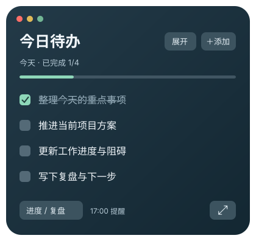

# Floating Todo · 今日悬浮待办

一个常驻桌面的轻量 macOS 待办。把今天要做的事放在视线里，完成后勾掉，到点回顾进度。

**当前支持 macOS；接下来的开发重点是进度更新与每日复盘。**

[下载最新版](https://github.com/jasperLiuzhipei/floating-todo-macos/releases/latest) · [使用指南](docs/USER_GUIDE.md) · [复盘路线图](ROADMAP.md) · [报告问题](https://github.com/jasperLiuzhipei/floating-todo-macos/issues)

<p align="center"></p>

*界面示意，实际原生控件会随 macOS 主题变化。*

## 下载后直接用

1. 从 [Releases](https://github.com/jasperLiuzhipei/floating-todo-macos/releases/latest) 下载 `FloatingTodo-版本号-macOS-universal.zip`。
2. 解压，把 **Floating Todo.app** 拖入「应用程序」，双击打开。
3. 点击右上角 **＋添加**，输入任务。无需终端、Python、API Key 或 Codex。
4. 完成任务后勾选；菜单栏入口可重新打开窗口、设置提醒或查看历史文件。

发布包包含 Apple Silicon 与 Intel 两种架构，最低部署版本为 **macOS 13**。当前在 Apple Silicon 上做过实际启动验证；Intel 和 macOS 13 的真机验证仍待补充。

**首次打开提示：** 当前社区版本使用本地临时签名，尚未通过 Apple Developer ID 签名和公证。从互联网下载后，macOS 可能要求在「系统设置 → 隐私与安全」中确认“仍要打开”。仅在你确认下载来源可信后操作，参见 [Apple 官方说明](https://support.apple.com/102445)。之后可正常双击使用。无需关闭系统安全保护。

## 已支持

- 半透明桌面悬浮窗，可拖动位置，跨桌面显示，跟随系统主题。
- 任务勾选、划线、撤销，状态自动保存到本机。
- **内容决定尺寸**：100% 时宽度在 320–520 逻辑点之间自适应，长标题完整换行；高度随任务数量变化。
- 右下角拖拽手柄整体缩放，顶部窗口按钮保留独立空间。
- 精简 / 展开模式：收起任务说明、透明度设置和操作提示。
- 本地添加任务，安装后即可使用。
- 可选 Codex 对话绑定：点击添加后跳回指定对话，询问任务内容；助手追加后清单自动刷新。
- 每日复盘提醒，默认 **17:00、当前系统时区**，可在设置中关闭或修改。
- 复盘弹窗展示已完成与待完成清单，提供成果、阻碍、下一步三个问题，支持复制。
- 次日自动归档前一天清单，并带入未完成任务。

窗口关闭后应用仍在菜单栏运行，提醒继续；选择「退出」后停止提醒。再次双击 App 会重新显示现有窗口。

## 进度复盘：现在与下一步

当前提供**勾选状态、完成数量、每日提醒、复盘清单与历史快照**。完成比例只是任务数量比例，不代表工作量或业务成果。

下一阶段优先做：

1. 记录「未开始 / 进行中 / 阻塞 / 已完成」和阶段进度。
2. 每项任务保存成果、阻碍、下一步与预计完成时间。
3. 在应用内完成每日复盘，保存为 Markdown / JSON，之后支持周复盘。
4. 可选 AI 辅助归纳，保留来源与用户确认，不把推测写成已完成事实。

这些是计划中的能力，**首版尚未提供**。具体范围、验收条件和顺序见 [ROADMAP.md](ROADMAP.md)。

## 数据与隐私

任务默认保存在：

```text
~/Library/Application Support/FloatingTodo/
├── tasks.json       # 当前清单
├── settings.json    # 提醒与可选 Codex 设置
└── history/         # 每日任务快照
```

不需要账号，不内置遥测、广告、远程数据库或自动更新。任务数据不会随升级应用一起替换。仓库与发布包只含代码和示例，不含作者的实际任务、私人对话 ID 或访问凭据。

只有主动配置并使用 Codex 添加功能时，才会通过本机 Codex CLI 向指定对话发送请求。其数据处理遵循你的 Codex 账户与环境设置。细节见 [隐私与安全说明](SECURITY.md)。

## 可选：与 Codex 配合

菜单栏 → **设置** → 填写自己的 Codex 对话 ID。CLI 路径通常自动发现，也可手动指定。

需要已登录的 Codex，以及支持 `codex queue` 的 CLI；助手通过随应用附带的 Python 脚本追加任务，所以这一可选链路需要 Python 3。本地添加任务不受影响，菜单栏始终保留「直接添加任务」。[配置与排障](docs/CODEX_INTEGRATION.md)

## 从源码构建

需要 macOS、Xcode Command Line Tools（`xcode-select --install`）与 Python 3，无第三方运行时依赖。

```bash
git clone https://github.com/jasperLiuzhipei/floating-todo-macos.git
cd floating-todo-macos
python3 scripts/test.py
python3 scripts/build_app.py
open "dist/Floating Todo.app"
```

默认生成双架构 `.app`、ZIP 和 SHA-256 校验文件。仅构建本机架构可用 `--arch arm64` 或 `--arch x86_64`。

```bash
# 使用隔离数据目录调试，避免影响个人清单
"dist/Floating Todo.app/Contents/MacOS/FloatingTodo" --data-dir /tmp/floating-todo-dev
```

[架构与开发说明](docs/DEVELOPMENT.md) · [贡献指南](CONTRIBUTING.md) · [版本记录](CHANGELOG.md)

## 当前边界

- 仅 macOS；Windows / Linux 不在首版支持范围内。
- 应用退出或电脑关机时无法提醒；当日启动或唤醒后会补检查，不追发历史日期提醒。
- 目前没有开机自启、任务编辑 / 删除 UI、任务优先级、历史浏览 UI或云同步。
- 每日复盘目前是清单和问题引导，尚未在应用内保存结构化复盘答案。
- 没有安装作者本机的 Codex 定时任务，也不要求安装任何私人插件。

## 许可证

[MIT](LICENSE)。欢迎围绕进度记录与复盘体验提 Issue 或 Pull Request。
